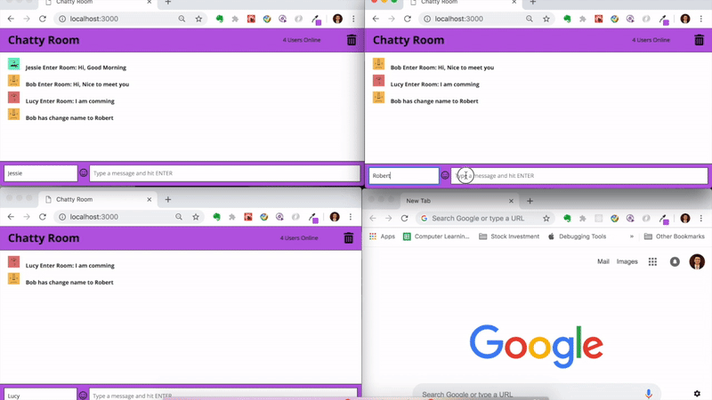
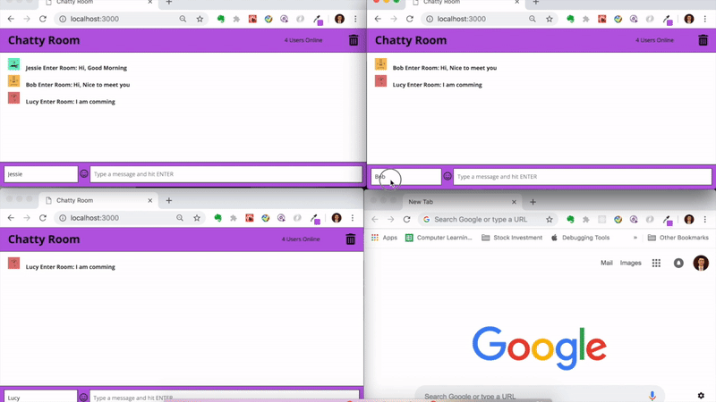
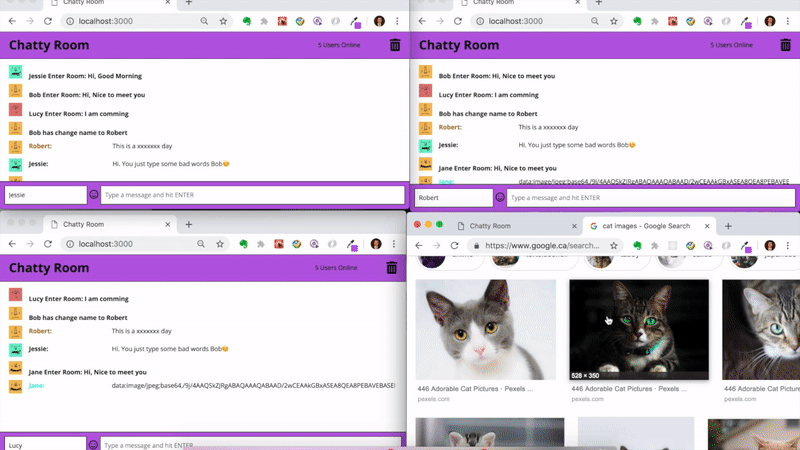
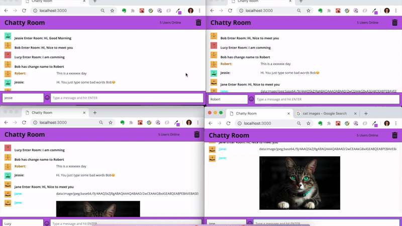

Chatty Room
=====================

A ReactJS project that allows users to communicate with each other without having to register accounts. This is a slack-simulated real-time chatty app. This App communicates with a server via WebSockets for multi-user real-time updates

### Features
* User Count. This app will display the total number of connected users and nofity when a new connection happens
* Support Message containing both text and image. Online image link (http, https) with image extension (.jpg, .png etc) will be detected and display as image instead of plain test
* Customized Avatar and colored name. Each user will be assigned a randomly avatar and a unique color in order to all users to distinguish each other
* Clear Chat History. User is able to delete all old message
* Emoji Support. This chatty app support most common emoji
* Words Filter. This app is equipped with bad words filter. Inappropriate words will be filtered and replaced by '*'


### Demo
 - Enter The Chat Room
 

 - Multiple Chat Window
 

 - Change User Name
 

 - Send Image
 

 - Delete Conversion
 

### Get Started
Clone this repo to your local machine. Make sure you have npm and node installed
```
git clone git@github.com:C-Shi/ChattyApp-LHL.git chatty_app
```

This App will have a front-end react app, and a server side WebSocket. To make this app work, you need to install package for both app.
* Install React App
```
cd chatty_app
npm install
npm start
```

* Install WebSocket Server
```
cd chatty_server
npm install
npm start
```

* Start Chatting
Open `http://localhost:3000/build/my_image.png`

### Dependencies 
* react
* react-dom
* Webpack
* Express
* ws
* uuid
* bad-words
* [babel-loader](https://github.com/babel/babel-loader)
* [webpack-dev-server](https://github.com/webpack/webpack-dev-server)

### Feature Improvement Possibilities
1. Users should be able to upload their own avatar
2. Users should be able to customize their theme color
3. Users should be able to know who is online and who goes offline